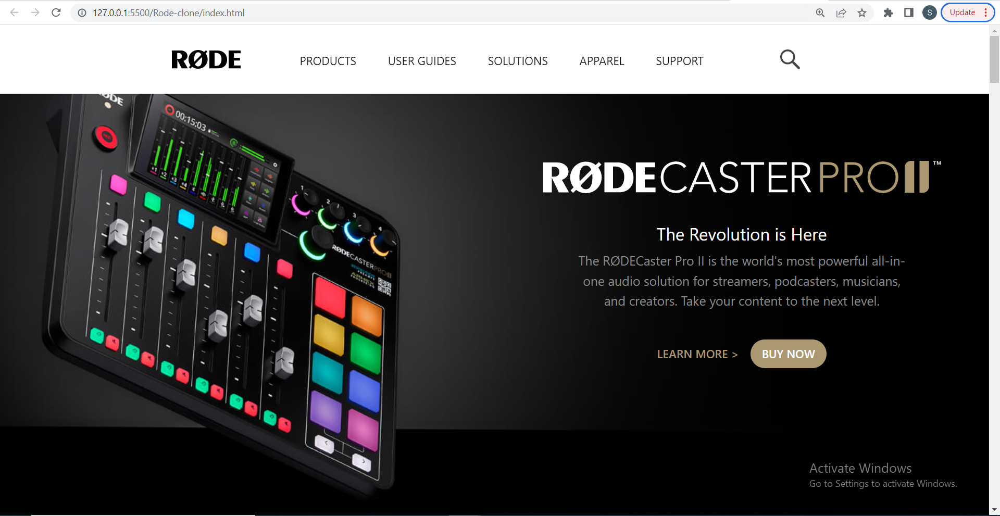
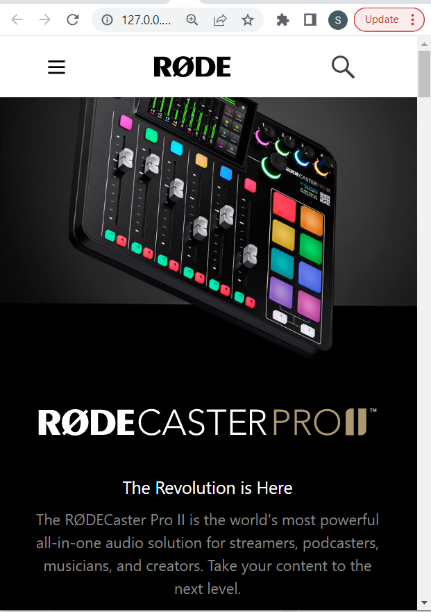

# Rode-Clone

This is basically a clone of [Rode](https://rode.com/en) made purely in HTML5 and tailwind css a utility first css Framework.
This has also been made mobile responsive for better view using Tailwind CSS
Hope you like my project !!

## Technologies Used
  - HTML
  - Tailwind css - A Utility First Framework of CSS

## Demo
### Laptop View


### Mobile Screen View


## Run Locally

Clone the project

```bash
  git clone https://github.com/suhas-sm/Rode-clone.git
```

Go to the project directory

```bash
  cd Rode-clone
```

## Features

- Royalty Free Images used
- Hover Effect
- Beautifull UI/UX Design
- Clone Website
- Hosted on Netlify and set up in production
- Tried to replicate Rode website
- Made it mobile responsive

## What i have learnt By working on this project
1. Got a hands on experience in using tailwind components.
2. Got to know different components used

## Honest Time to finish the project

I had took about 7hrs.

## Feedback
If you have any feedback, please reach out to us at melmurissm11@gmail.com
